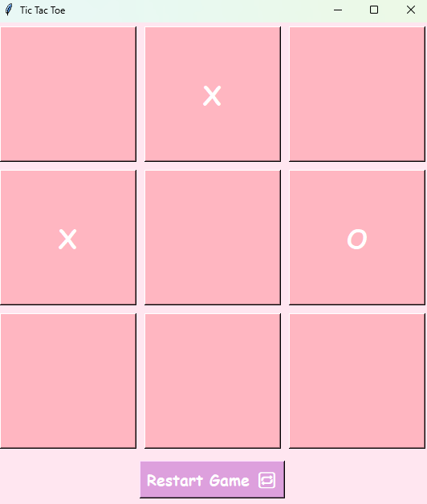

# 🎀 Tic Tac Toe — Cute Edition 🌸

A simple and aesthetic Tic Tac Toe game made with Python and Tkinter.  
Two players (❌ & ⭕) take turns to mark their spot — whoever gets 3 in a row first wins!  
Designed with a soft pink GUI to match your girly coder vibes 💗

---

## 📸 Preview
> 

---

## 🌟 Features

- 🎀 Pretty pink GUI
- ✌️ 2-player mode (X vs O)
- 🏁 Win detection: rows, columns, diagonals
- 🚫 Disabled buttons after move
- 🔁 "Restart Game" button
- 💖 Cute fonts, soft colors
- ✅ All in pure Python (no extra libraries!)

---

## 🛠 Tech Stack

| Tool       | Purpose            |
|------------|---------------------|
| Python     | Programming language |
| Tkinter    | GUI framework        |
| Comic Sans | Font for aesthetic   |
| Emojis     | ✨ sprinkle of fun    |

---

## 📜 License

MIT License  
Free to modify, remix, and build your own versions 💕

---

